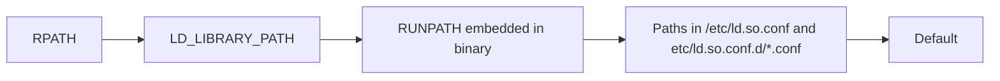

# Internal Priv Esc 
## Kernel Exploit 
```
uname
cat /etc/lsb-release
```
```
1. Find out if GCC is installed on system, as most exploits require this
2. If GCC installed, search
- searchsploit
- msfconsole
- vulnx
- sploitsearch
- exploit.db
For matching exploit.
```
### Shared Object Hijacking/Shared Library

[Tutorial One](https://www.youtube.com/watch?v=Cx3_eVNIeHw)

[Tutorial Two](https://open-2v.gitbook.com/url/hacking-notes.jord4n.pro/privesc/shared-library-hijacking/libwelcome-shared-library-hijacking-linux-privilege-escalation)

[Tutorial Three](https://hackindex.io/platforms/linux/privilege-escalation/shared-library-hijacking)
>[!NOTE]
>
>Privileged binaries load shared binaries and search several locations in a defined order, and if you can write to any directory in teh search path before the legit one is found, you can intercept load and execute arbitrary code as binary's owner.


